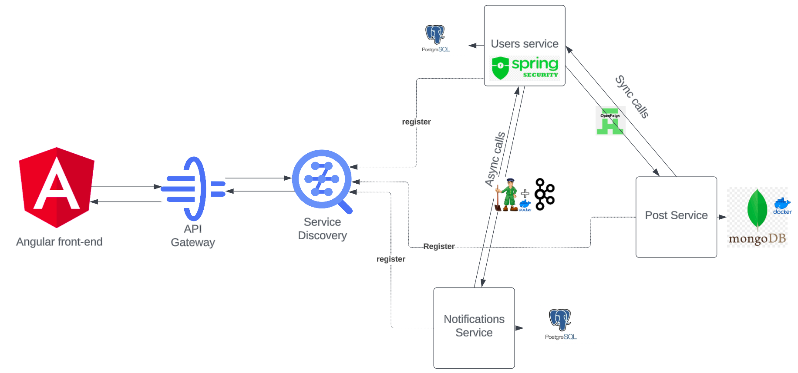

# An Over-engineered version of Hacker News website 

> A web app, built with spring ecosystem and angular for learning purposes.

🌀 This Application is `not-completed` and you're welcome to clone, learn and develop it more. 🌀

## Features
- ✅ Using `Postgres` and `MongoDB` for database (you can use docker to run them)
- ✅ Using `Event Driven Architecture` on top of Kafka
- ✅ Using `Service Discovery` with `Eureka server` 
- ✅ Using `API Gateway` with `Spring Cloud Gateway`
- ✅ Using `OpenFeign`  for http calls between microservices

## Roadmap
- 🚧 Add `Api Key Management` with `Keycloak` for security and authentication.
- 🚧 Using `Helm` or `Kustomize` for deploying the application on `Kubernetes` cluster.
- 🚧 Add `Resilience4j` for circuit breaker and fallback.
- 🚧 Add log aggregation with `ELK` stack.
- 🚧 Add `Istio` for service mesh.

## Technologies - Libraries

- ✔️ **[`eureka-server-discovery`](https://spring.io/guides/gs/service-registration-and-discovery/)** - Eureka is a service registry for resilient spring microservices.
- ✔️ **[`spring-cloud-gateway`](https://cloud.spring.io/spring-cloud-gateway/reference/html/)** - Spring Cloud Gateway is a non-blocking, reactive, based on Spring 5, web server gateway.
- ✔️ **[`open-feign`](https://cloud.spring.io/spring-cloud-openfeign/reference/html/)** - Declarative REST Client for spring.
- ✔️ **[`spring-boot-starter-data-jpa`](https://spring.io/projects/spring-data-jpa)** - Spring Data JPA is a layer on top of the JPA API.
- 
- ✔️ **[`lombok`](https://projectlombok.org/)** - Project Lombok is a java library that automatically plugs into your editor and build tools, spicing up your java.
- ✔️ **[`Junit5`](https://junit.org/junit5/)** - For unit testing and integration testing.
- ✔️ **[`docker-compose`](https://docs.docker.com/compose/)** - Compose is a tool for defining and running multi-container Docker applications.
- ✔️ **[`Apache Kafka`](https://kafka.apache.org/)** - Apache Kafka is an open-source distributed event streaming platform used by thousands of companies for high-performance data pipelines, streaming analytics, data integration, and mission-critical applications. 
- ✔️ **[`Angular`](https://angular.io/)** - A TypeScript-based open-source framework for building web applications. 

## System Architecture

## How to run

